<p align="center">
  
</p>

**rolloutscope reads the logs from a finished RL run and shows you where the model gamed
its reward instead of doing the task, with the exact offending text highlighted, in a
single HTML report you open in your browser.** It runs offline and CPU-only: no model,
no GPU, no network at analysis time.

## Quickstart

```bash
uv sync --extra dev
uv run rolloutscope analyze tests/fixtures/demo --out report.html
open report.html            # macOS; use xdg-open on Linux
```

That analyzes a bundled demo run and writes a self-contained HTML report. Point `analyze` at
your own run instead (a verifiers `results.jsonl` directory, or prime-rl
`train_rollouts.jsonl` step directories) to scan real rollouts, and add
`--json findings.json` for a machine-readable sidecar. Bad rows are skipped and logged,
never fatal, and the reader streams line by line, so inputs larger than RAM are fine.

To gate CI on findings, `analyze` exits 0 by default but takes `--fail-on info|warning|critical`.
Other commands: `detectors list`, `convert`, `schema export`, `--help`.

## Why

RL against an automatic reward drifts toward whatever the reward measures, which is not
always the task. A judge that likes long answers, a rubric that scores format, a coding
harness whose tests can be deleted: each is a signal a policy can climb without getting
better. Those failures are visible in the logged rollouts if you know what to look for.
rolloutscope looks, over a run you already have on disk, and shows its work: every flag
carries the offending span, so a finding is something you can verify, not just a number.

## What it detects

All six run in snapshot mode; the saturation and length detectors gain trend variants
when the rollouts carry a `step_index`. Every threshold is a conservative, clearly
labeled heuristic and is configurable (see Configuration); none are taken from a paper
without a verified citation.

| id | category | core signal |
|---|---|---|
| `verifier_tamper` | verifier_tampering | test edits, assert deletion, skips, forced exit 0, monkeypatched checkers, always-pass bodies |
| `reward_saturation_group_collapse` | reward_saturation | within-group reward variance collapsing to zero (the on-disk GRPO dead-group proxy), and its rise over steps |
| `length_inflation` | rubric_judge_exploit | reward correlating with completion length while an independent correctness metric stays flat |
| `format_only_wins` | rubric_judge_exploit | a format or parser metric near max while correctness is near zero and the scalar reward still clears a floor |
| `degenerate_repetition` | degeneracy | high n-gram repetition and low distinct-token ratio on a single high-reward completion |
| `answer_leakage_echo` | context_exploitation | the completion echoing the ground-truth `answer` or a reward criterion with no work shown |

Each detector documents its known false-positive modes in its own docstring and ships at
least one labeled hacked fixture and one clean fixture that it must separate.

## Validation

Beyond the synthetic fixtures, the detectors are checked against the Patronus TRACE
dataset (arXiv:2601.20103), a labeled set of real reward-hacking coding-agent
trajectories. Mapping 300 rows into the schema and running the two detectors this dataset
can legitimately exercise:

| detector | hacked fire rate | clean fire rate | gap |
|---|---|---|---|
| `verifier_tamper` | 0.56 (85/153) | 0.50 (73/147) | +0.06 |
| `answer_leakage_echo` | 0.00 (0/153) | 0.00 (0/147) | +0.00 |

Read honestly: `verifier_tamper` fires more on reward-hacking trajectories than on clean
ones, but the separation is modest, because normal coding agents also edit tests and run
commands that trip its heuristics, so the base rate is high. `answer_leakage_echo` stays
silent because TRACE carries no ground-truth answer or grading criteria for it to key on;
it is shown here to make clear the tool reports 0 rather than inventing findings.

Reproduce it (the dataset is gated, so put a Hugging Face `HF_TOKEN` in a `.env` at the
repo root):

```bash
uv run python scripts/trace_validation.py   # prints the table above
uv run pytest -m integration                # the same check as a test
```

## Configuration

Pass a TOML file with `--config`. Tables map onto the detector, aggregation, and severity
settings; anything omitted keeps its default.

```toml
[severity]
critical_at = 0.8      # max fired score at or above this is critical
warning_at = 0.5       # at or above this is warning, else info

[detectors.length_inflation]
min_correlation = 0.85 # Pearson r of length vs reward required to fire

[aggregation]
histogram_bins = 20    # reward histogram resolution
```

```bash
uv run rolloutscope analyze <run> --config myconfig.toml
```

## Design

- **The schema is the product.** Every row is a pydantic v2 `Rollout` (a discriminated
  union on `kind`) carrying a per-row `schema_version`, with unknown upstream keys
  preserved. Changes within a major version are additive; breaking changes bump the major
  and ship a migration. See `docs/adr/0001-normalized-rollout-schema.md`.
- **Stable, content-derived IDs.** `rollout_id`, `group_id`, and `run_id` come from the
  content, so a v1 white-box store (activations, SAE features) can join onto v0 findings
  on `(run_id, rollout_id, step_index)` without re-ingesting anything.
- **Core never imports verifiers or prime-rl.** Only the adapters know the upstream
  on-disk shapes, and they parse them from pinned reference docs rather than importing
  those libraries. The schema, detectors, analysis, and report packages depend only on
  the normalized types.
- **Detectors are pure functions with evidence.** Each returns structured `Verdict`
  objects, and a fired verdict without its offending span is invalid by construction.
- **The report is a pure function of findings.** The HTML is one self-contained file:
  inline CSS, server-side SVG charts, `<details>` collapsibles, zero JavaScript, no CDN,
  no fetch. It opens from `file://`.

## Development

```bash
uv sync --extra dev
uv run pytest -q              # offline test suite
uv run pytest -m integration  # optional network tests (TRACE, needs HF_TOKEN, skips otherwise)
uv run ruff check .           # lint
uv run ruff format .          # format
uv run mypy src/              # types
```

See [CONTRIBUTING.md](CONTRIBUTING.md) for project conventions and a walkthrough of
writing your own detector as a plugin.

## License

Apache-2.0. See [LICENSE](LICENSE).
