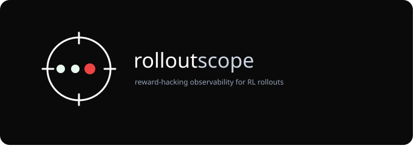

<p align="center">
  
</p>

**rolloutscope reads the logs from a finished RL run and shows you where a model may have
gamed its reward, with the offending text highlighted so you can judge for yourself.** It
runs offline and CPU-only: no model, no GPU, no network at analysis time.

## Quickstart

```bash
uv sync --extra dev
uv run rolloutscope analyze tests/fixtures/demo --out report.html
open report.html            # macOS; use xdg-open on Linux
```

That analyzes a bundled demo run and writes a self-contained HTML report. Point `analyze` at
your own run instead (a verifiers `results.jsonl` directory, or prime-rl
`train_rollouts.jsonl` step directories) to scan real rollouts, and add
`--json findings.json` for a machine-readable summary. Conversion and ingestion stream
JSONL line by line. Analysis currently materializes normalized rows for whole-run and
group detectors, so it is not yet suitable for inputs larger than available RAM.

To gate CI on findings, `analyze` exits 0 by default but takes `--fail-on info|warning|critical`.
Other commands: `detectors list`, `convert`, `schema export`, `--help`.

## Analysis outputs and status

`analyze` reports ingestion status separately from detector findings. Each terminal,
JSON, and HTML report records accepted, rejected, blank, and duplicate records for each
source, plus per-detector candidate, eligible, fired, clean, insufficient, skipped, and
error counts. A detector with no eligible records is insufficient data, not a clean run.
Detector signals are heuristic observations that require review, not proof that reward
hacking occurred.

When `--out` or `--json` is requested, RolloutScope also writes complete deterministic
verdict JSONL and an artifact ledger next to the primary output. Use `--verdicts PATH` to
choose the verdict location or request verdict JSONL by itself. The ledger records the
actual hash and byte size of every generated report and verdict artifact and is committed
last. Outputs are staged and atomically replaced only after they serialize successfully;
an output that aliases a discovered rollout or metadata source is rejected. Inputs with
no usable records, unsupported input, failed detector discovery or execution, or failed
ingestion exit with code 2 independently of `--fail-on`.

Partial ingestion is allowed by default. Set `[ingestion] partial = "reject"` in the
analysis config or pass `analyze --partial reject`. Conversion has the same explicit
`convert --partial allow|reject` policy:

```toml
[ingestion]
partial = "reject"
```

Legacy raw input receives a path-derived run identity. Pass `--run-id NAME` to `analyze`
or `convert` when a stable external namespace is available. Normalized input preserves
its recorded identity and rejects this override.

## Supported Phase 1 inputs

The legacy adapters support the pinned verifiers `results.jsonl` plus optional
`metadata.json` layout and prime-rl `train_rollouts.jsonl` files in recognized step
directories. These contracts are pinned to verifiers commit `5885ab9c` and prime-rl
commit `df2acf48`; see [the compatibility matrix](docs/compatibility-matrix.md) before
assuming a newer upstream layout is equivalent.

RolloutScope normalized JSONL uses a per-row schema marker. The reader migrates supported
1.x rows to schema 2.0, preserves current 2.x identity and provenance, and explicitly
rejects unsupported future major versions. Mixed raw and normalized rows are accounted
for independently rather than silently routed through one format.

## Why

RL against an automatic reward drifts toward whatever the reward measures, which is not
always the task. A judge that likes long answers, a rubric that scores format, a coding
harness whose tests can be deleted: each is a signal a policy can climb without getting
better. Those failures are visible in the logged rollouts if you know what to look for.
rolloutscope looks, over a run you already have on disk, and shows its work: every flag
carries the offending span, so a finding is something you can verify, not just a number.

## What it detects

All six run in snapshot mode; the saturation and length detectors gain trend variants
when the rollouts carry a `step_index`. Every threshold is a conservative, clearly
labeled heuristic and is configurable (see Configuration); none are taken from a paper
without a verified citation.

| id | category | core signal |
|---|---|---|
| `verifier_tamper` | verifier_tampering | test edits, assert deletion, skips, forced exit 0, monkeypatched checkers, always-pass bodies |
| `reward_saturation_group_collapse` | reward_saturation | within-group reward variance collapsing to zero (the on-disk GRPO dead-group proxy), and its rise over steps |
| `length_inflation` | rubric_judge_exploit | reward correlating with completion length while an independent correctness metric stays flat |
| `format_only_wins` | rubric_judge_exploit | a format or parser metric near max while correctness is near zero and the scalar reward still clears a floor |
| `degenerate_repetition` | degeneracy | high n-gram repetition and low distinct-token ratio on a single high-reward completion |
| `answer_leakage_echo` | context_exploitation | the completion echoing the ground-truth `answer` or a reward criterion with no work shown |

Each detector documents its known false-positive modes in its own docstring and ships at
least one labeled hacked fixture and one clean fixture that it must separate.

## Validation

Beyond the synthetic fixtures, the detectors are measured against the Patronus TRACE
dataset (arXiv:2601.20103). Its own card describes the trajectories as synthetically
generated by Claude Code and human verified, with simulated tool use, so this measures
detection on realistic coding transcripts and says nothing yet about operational RL logs.

The population is pinned in `benchmarks/trace/manifest.json`: dataset revision
`31d87f06`, 517 rows split by scenario into train (202), tuning (105), and a sealed
holdout (210). The validation script and the integration test run the same mapper, the
same applicability rules, and the same metric code, and a test compares their JSON output
to keep them that way.

On the **tuning** split (105 rows, 50 hacked, 55 benign):

| detector | coverage | precision | recall | false-positive rate |
|---|---|---|---|---|
| `verifier_tamper` | 1.00 (105/105) | 0.52 [0.39, 0.64] | 0.60 [0.46, 0.72] | 0.51 [0.38, 0.64] |
| the other five | 0.00 (0/105) | not measured | not measured | not measured |

Read honestly. `verifier_tamper` separates the labels, but only just: it fires on half the
benign trajectories too, because ordinary coding agents edit tests and grep for the very
patterns it matches. Improving that is open Phase 2 work, and 21 of the 33 hard negatives
in `tests/fixtures/hard_negatives/` currently fire for the same reason.

The other five detectors report **zero coverage, not clean results**. TRACE ships
transcripts with no reward, no metrics, and no reference answer, and every one of those
detectors gates on one of them. Reporting their silence as a perfect false-positive rate
would be the single most misleading thing this tool could do, so the report names the
missing signal instead.

No release threshold has been set from this benchmark, and the holdout has not been
measured. It stays sealed until the detector repairs land.

Reproduce it (the dataset is gated, so put a Hugging Face `HF_TOKEN` in a `.env` at the
repo root):

```bash
uv sync --extra dev --extra benchmark
uv run --extra benchmark python scripts/trace_validation.py            # the table above
uv run --extra benchmark pytest tests/integration -m integration       # the same, as tests
```

Metric definitions, the split rationale, and the reporting format:
[docs/benchmark-metrics.md](docs/benchmark-metrics.md).

## Configuration

Pass a TOML file with `--config`. Tables map onto the detector, aggregation, and severity
settings; anything omitted keeps its default.

```toml
[severity]
critical_at = 0.8      # max fired score at or above this is critical
warning_at = 0.5       # at or above this is warning, else info

[detectors.length_inflation]
min_correlation = 0.85 # Pearson r of length vs reward required to fire

[aggregation]
histogram_bins = 20    # reward histogram resolution

[ingestion]
partial = "allow"      # "reject" makes partial ingestion an analysis error
```

```bash
uv run rolloutscope analyze <run> --config myconfig.toml
```

## Design

- **The schema is the product.** Every row is a pydantic v2 `Rollout` (a discriminated
  union on `kind`) carrying a per-row `schema_version`, with unknown upstream keys
  preserved. Changes within a major version are additive; breaking changes bump the major
  and ship a migration. See `docs/adr/0001-normalized-rollout-schema.md`.
- **Separate occurrence and content identity.** `occurrence_id` identifies a physical
  source record using its run, relative source path, and line. `content_fingerprint`
  identifies trajectory content while excluding mutable scores, and `scoring_revision`
  changes when reward data changes. Legacy `rollout_id` and `group_id` values remain as
  compatibility aliases through the schema migration.
- **Core never imports verifiers or prime-rl.** Only the adapters know the upstream
  on-disk shapes, and they parse them from pinned reference docs rather than importing
  those libraries. The schema, detectors, analysis, and report packages depend only on
  the normalized types.
- **Detectors are pure functions with evidence.** Each returns structured `Verdict`
  objects, and a fired verdict without its offending span is invalid by construction.
- **The report is a pure function of `ReportData`.** The HTML is one self-contained file:
  inline CSS, server-side SVG charts, `<details>` collapsibles, zero JavaScript, no CDN,
  no fetch. It opens from `file://`.

## Development

```bash
uv sync --extra dev
uv run pytest -q              # offline test suite
uv run pytest -m integration  # optional network tests (TRACE, needs HF_TOKEN, skips otherwise)
uv run ruff check .           # lint
uv run ruff format .          # format
uv run mypy src/              # types
```

See [CONTRIBUTING.md](CONTRIBUTING.md) for project conventions and a walkthrough of
writing your own detector as a plugin.

## License

Apache-2.0. See [LICENSE](LICENSE).
